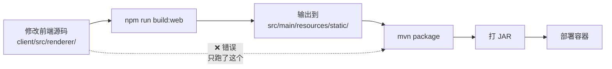

# 项目发布管理 — 分支策略 & 发版 & 环境隔离

> 通用的 Git 分支策略 + 多环境部署方案，适用于 CLI / 后端 / 微服务等各类项目

---

## 环境架构

### 机器分配原则

| 机器 | 部署环境 | 说明 |
|------|---------|------|
| 本机 | **开发环境 (dev)** | 日常编码，git checkout feat/* |
| 部署机 | **预发环境 (staging)** + **正式环境 (prod)** | Docker 部署，各自隔离 |

### 共享服务策略

**成熟基础设施（数据库、消息队列、AI 推理、网关等）不重复部署**，所有环境共用同一套实例：

```
        ┌─ 共享基础设施（1 套）────────────────┐
        │  DB · Cache · AI API · 网关 · 队列   │
        └──────────────┬───────────────────────┘
                       │
    ┌──────────────────┼──────────────────┐
    │                  │                  │
    ▼                  ▼                  ▼
 ┌──────┐         ┌────────┐        ┌────────┐
 │ dev  │         │staging │        │ prod   │  ← 项目容器/进程
 │config│         │config  │        │config  │     仅配置不同
 │DB    │         │DB      │        │DB      │
 └──────┘         └────────┘        └────────┘
```

### 环境隔离方式

**服务共享，数据隔离。** 每套环境仅隔离项目本身的状态数据：

| 隔离项 | 方式 |
|--------|------|
| 配置文件 | 各自一份，指向不同路径 |
| 数据库 | 各自独立 DB（或不同 schema / database） |
| 数据目录 | 各自独立目录 |
| 日志 | 各自独立文件 |

---

> ⚠️ **实际项目采用 Git Flow 变体：`main` → `develop` → `feat/*`**
> 本 skill 的 `main → release/* → feat/*` 是通用模板。以下文档的是本项目的实际规范。

## Git 分支策略（本项目实际使用）

```
main ──────●────────────────────────────  ← 正式上线 (prod)
            \                    /
develop ────●───────────────●───●───────  ← 集成测试/CI 部署 (staging)
                 \         /   /
feat/* ────────────●───────    /          ← 功能开发 (dev)
                              /
fix/* ──────────────────────●             ← 修复分支
```

### 分支说明

| 分支 | 说明 | CI 部署 | 合并来源 |
|------|------|---------|---------|
| `main` | 生产分支 | 部署正式环境 | develop → main（PR） |
| `develop` | 集成测试分支 | ✅ CI 部署到 staging | feat/* → develop（PR） |
| `feat/*` | 功能开发 | ❌ 不部署 | 从 develop 拉出 |
| `fix/*` | 修复分支 | ❌ 不部署 | 从 develop 或 main 拉出 |

### 分支污染防则（重要）

- **`feat/*` 分支只含功能相关代码** — CI 修复、配置调整等非功能变动必须走 `fix/*` 分支
- **`fix/*` 分支只含修复相关代码** — 新功能不要混进修复分支
- 不小心在错误分支上写了 commit → 用 `cherry-pick` 转移到正确分支后 `reset --hard` 清理原分支
- 合并前检查分支内容是否纯净：`git log --oneline feat/my-feature --not develop`

### 保护规则（严格）

- **`develop` 禁止直接 push** — 只能通过其他分支合并进来
- `main` 只接受 `develop` 合并，不直接 push
- `feat/*` / `fix/*` 定期合并到 `develop` 进行集成测试
- 合并前 rebase 目标分支以保持线性历史

### 完整流程

```bash
# 1. 新功能 — 从 develop 拉 feat 分支
git checkout develop && git pull
git checkout -b feat/my-feature

# ... 编码、提交 ...

# 2. 合并回 develop（走 PR 或本地 merge）
git checkout develop
git merge feat/my-feature    # 或 squash merge
git push origin develop

# 3. 发版 — develop → main
git checkout main
git merge develop
git tag v1.0.0
git push origin main --tags

# 4. 修复
git checkout -b fix/crash-issue develop
# ... 修复 ...
git checkout develop
git merge fix/crash-issue
git push origin develop
```

---

以下是通用模板（适合非 Git Flow 项目）：

```
main ──────●───────────────●──────────────  ← 正式上线 (prod)
            \             /
release/v* ──●───────●─────────            ← 预发测试 (staging)
                 \     /
feat/* ────────────●                       ← 开发中 (dev)
```

### 分支说明

| 分支 | 命名格式 | 部署环境 | 合并来源 |
|------|---------|---------|---------|
| `main` | `main` | **prod** | release/* → main |
| `release/*` | `release/v<版本>` | **staging** | feat/* → release/* |
| `feat/*` | `feat/<功能>` | **dev**（本机） | 自由开发 |

### 保护规则

- `main` 只接受 release 分支合并，不直接 push
- `release/*` 由维护者创建，feat 分支合并进来后部署预发
- `feat/*` 开发者随意，合并到 release 前先 rebase main

---

## 完整迭代流程

### 1. 开发阶段（本机 dev）

```bash
git checkout feat/my-feature
# ... 写代码 ...
git add . && git commit -m "feat: 功能描述"
git push
```

### 2. 准备发版 → 创建 release 分支

```bash
git checkout main && git pull
git checkout -b release/v1.2.0
git merge feat/my-feature
# 解决冲突
git push origin release/v1.2.0
```

### 3. 部署预发环境 → staging

```bash
ssh deploy-machine
cd /path/to/project-staging
git fetch && git checkout release/v1.2.0 && git pull
pip install -e .
cp config.staging.yaml config.yaml
```

### 4. 预发验证

```bash
app --version && pytest && app run --test
```

### 5. 验证通过 → 合并到 main → tag 上线

```bash
git checkout main && git merge release/v1.2.0
git tag v1.2.0 && git push origin main --tags
git branch -d release/v1.2.0
git push origin --delete release/v1.2.0
```

### 6. 部署正式环境 → prod

```bash
ssh deploy-machine
cd /path/to/project-prod
git checkout main && git pull
pip install -e .
cp config.prod.yaml config.yaml
app --version
```

### 7. 修复补丁

```bash
git checkout release/v1.2.0
# 修 bug → commit → push
# 重新部署预发验证
# 通过后合并回 main + feat
git checkout main && git merge release/v1.2.0 && git push
git checkout feat/my-feature && git merge release/v1.2.0 && git push
```

---

### CI 集成

项目使用 GitHub Actions self-hosted runner 自动构建和部署。CI 流程：

- `develop` 分支 push → 编译测试 → Docker build → 部署 staging
- `main` 分支 push → 编译测试 → Docker build → SSH 推送到正式机

Windows 自托管 runner 的排错（代理、PATH、Maven、PowerShell、env 文件）详见：
- `windows-development-tips` skill → `references/self-hosted-runner-ci.md`

Dockerfile 构建加速（国内网络）：
- 基础镜像用 `docker.m.daocloud.io/` 前缀替代 Docker Hub
- Maven build stage 写入阿里云镜像 settings.xml 避免依赖拉取超时

---

## ⚡ 构建顺序陷阱（常见错误）

前端（Vite）和后端（Maven）是**两个独立的构建步骤**。最常见的错误：改前端代码 → 只跑 `mvn package` → 部署 → 前端无变化。

### 根因



`mvn package` 只打包 `src/main/resources/static/` 里已有的文件，不会触发前端构建。如果前端源码改了但没跑 `build:web`，JAR 里的静态文件是旧的。

### 正确的完整构建顺序

```bash
# 方式 1：完整构建（推荐日常使用）
cd client && npm run build:web && cd ..        # ① 前端构建
mvn clean package -DskipTests                   # ② 后端打包（含前端文件）
docker compose up -d agent                      # ③ 重建容器

# 方式 2：仅后端变更（不改前端）
mvn package -q -DskipTests                      # ① 只编译
docker compose up -d agent                      # ② 重建
```

### 验证前端是否更新

```bash
# 对比 JAR 里的前端文件时间戳
unzip -l target/showing-agent-0.1.0.jar | grep "static/assets/index-" | head -3

# 或者直接看浏览器 DevTools → Network → 查看 JS/CSS 文件名 hash
# 新构建的文件名 hash 会变化
```

> ⚠️ **部署前自查清单**：
> - [ ] 改了前端源码？→ 先 `npm run build:web`
> - [ ] 只改了后端 Java？→ 直接 `mvn package + docker compose up -d`
> - [ ] 两个都改了？→ `npm run build:web` → `mvn package` → `docker compose up -d`

---

## Docker Compose 部署模板

### 目录结构

```
/project/
├── docker-compose.yaml
├── docker/
│   └── Dockerfile
├── staging/
│   ├── config.yaml
│   ├── data/
│   └── .env
├── prod/
│   ├── config.yaml
│   ├── data/
│   └── .env
└── .gitignore
```

### docker-compose.yaml 模板

```yaml
version: "3.8"

services:
  app-staging:
    build:
      context: .
      dockerfile: docker/Dockerfile
    container_name: app-staging
    volumes:
      - ./staging/config.yaml:/app/config.yaml
      - ./staging/data:/app/data
    env_file:
      - ./staging/.env
    restart: unless-stopped
    networks:
      - app-net

  app-prod:
    build:
      context: .
      dockerfile: docker/Dockerfile
    container_name: app-prod
    volumes:
      - ./prod/config.yaml:/app/config.yaml
      - ./prod/data:/app/data
    env_file:
      - ./prod/.env
    restart: unless-stopped
    networks:
      - app-net

networks:
  app-net:
    driver: bridge
```

### Dockerfile 模板（Python）

```dockerfile
FROM python:3.11-slim
RUN apt-get update && apt-get install -y --no-install-recommends git \
    && rm -rf /var/lib/apt/lists/*
WORKDIR /app
COPY . .
RUN pip install --no-cache-dir -e .
CMD ["tail", "-f", "/dev/null"]
```

### 部署脚本 deploy.sh

```bash
#!/bin/bash
set -e
ENV=${1:-staging}
BRANCH=${2:-main}

cd /path/to/project
git fetch && git checkout $BRANCH && git pull
docker compose build app-$ENV
docker compose up -d app-$ENV
docker compose ps
echo "=== 部署完成 ==="
```

---

## 部署速查表

| 场景 | 命令 |
|------|------|
| 推 release 分支 | `git checkout -b release/v1.0.0 main && git merge feat/* && git push` |
| 部署预发 | `ssh machine && cd /path/staging && git checkout release/v1.0.0 && git pull` |
| 合并上线 | `git checkout main && git merge release/v1.0.0 && git tag v1.0.0 && git push --tags` |
| 部署正式 | `ssh machine && cd /path/prod && git checkout main && git pull` |
| Docker 部署 | `docker compose build app-$ENV && docker compose up -d app-$ENV` |

---

## 常见问题

- **Q: 只有 staging + prod，不搞 test？** A: 成熟基础设施下，本地 dev 验证足够。
- **Q: release 分支用完要不要删？** A: 建议删除，保持仓库整洁。必要时可从 tag 重建。
- **Q: 预发出 bug 怎么办？** A: 直接在 release 分支修，重测后合并到 main + feat。
- **Q: 改了 schema.sql 但数据库表没变？** A: Docker 的 `docker-entrypoint-initdb.d/schema.sql` 只在**首次创建 Postgres 数据目录时**执行一次。后续对 schema.sql 的修改不会自动同步到已有数据库。这是最常见的"表/列不存在" root cause。诊断修复见下方「PostgreSQL Schema 漂移」章节。

---

## Flyway Migration 管理

项目使用 Flyway 进行数据库版本迁移（schema 变更 + 数据种子）。Flyway 由自定义 `FlywayConfig` 管理（非 Spring Boot 自动配置），配置类中 `spring.flyway.enabled = false`，通过 `ApplicationRunner` 手动执行。

### 核心配置

```java
Flyway flyway = Flyway.configure()
    .dataSource(dataSource)
    .locations("classpath:db/migration")
    .baselineOnMigrate(true)
    .baselineVersion("0")
    .placeholderReplacement(false)   // ← 重要
    .load();
flyway.migrate();
```

### 关键踩坑：Placeholder 替换

**问题**：Flyway 默认开启 placeholder 替换，将 `${xxx}` 识别为占位符。当 migration SQL 的字符串字面量中包含 `${HERMES_HOME:-~/.hermes}`（如 skill 正文/脚本内容）时，Flyway 报 `No value provided for placeholder: ${HERMES_HOME:-~/.hermes}`。

**修复**：添加 `.placeholderReplacement(false)` — 全局禁用占位符替换，让所有 `${...}` 按字面量处理。

**注意**：如果项目确实需要 Flyway 占位符（如 `${schema_name}`），改用前缀转义或自定义 `placeholderPrefix`。对于纯数据种子迁移，直接禁用是最简单安全的做法。

### 数据种子迁移（Seed Data）

当需要将一份已有数据集作为种子写入 Flyway 迁移时：

```bash
# 从运行中的数据库导出 INSERT 语句
docker compose exec -T postgres pg_dump \
  -U <user> --data-only --inserts \
  --table=skills --table=skill_files --table=skill_related \
  <database> > V5__Seed_skills.sql
```

#### 处理已有数据冲突

种子迁移在新部署（空库）和已有部署（已有数据）上都会执行。两种处理方式：

| 方式 | SQL | 适用场景 |
|------|-----|---------|
| **DELETE 优先** | 迁移顶部加 `DELETE FROM <表>` | 种子是 canonical 数据，以迁移内容为准，覆盖所有旧数据 |
| **ON CONFLICT** | INSERT 尾部加 `ON CONFLICT (pk) DO NOTHING` | 种子只补充缺失数据，不覆盖已有数据 |

**推荐 DELETE 方式**（种子迁移应是数据的权威来源）：

```sql
-- V5__Seed_skills.sql
-- Clear existing data: seed is canonical, replace all
DELETE FROM skill_related;
DELETE FROM skill_files;
DELETE FROM skills;
-- ... INSERT statements from pg_dump ...
```

注意：`DELETE FROM` 会因外键约束（ON DELETE CASCADE）级联删除关联数据，无需手动清理子表。

#### pg_dump 输出清理

pg_dump 输出的 INSERT 使用不含列名的 `VALUES (...)` 格式，必须确保列顺序与当前表定义一致。此外需要清除 pg_dump 自带的 meta 命令：

- 移除 `\restrict` / `\unrestrict` 行（psql 元命令，Flyway 不识别）
- 替换或删除头部/尾部注释
- 浮点/时间字面量中的 pg_dump 格式在目标 Postgres 版本中兼容

---

## PostgreSQL Schema 漂移 — Docker 部署陷阱

### 问题

`docker-entrypoint-initdb.d/schema.sql` 中的 `CREATE TABLE IF NOT EXISTS` 对**已有**表仅检查表名是否存在，不会对比列定义。因此：

1. 首次部署 → Postgres 容器初始化 → 按当时的 schema.sql 建表
2. 后续修改 schema.sql（加列、改主键、加索引）→ commit + docker compose up -d
3. **数据库没有任何变化** — `CREATE TABLE IF NOT EXISTS` 发现表已存在就跳过

### 症状

- 应用启动正常，但运行时 SQL 报 `bad SQL grammar` / `column "xxx" does not exist`
- Spring Boot 日志显示 `PreparedStatementCallback; bad SQL grammar`
- `\d <table>` 看到列数少于 schema.sql 定义
- 多次 `docker compose down && docker compose up -d` 无效（volume 数据持久化）

### 诊断

```bash
# 1. 确认列缺失
docker exec <postgres-container> psql -U <user> -c "\d <table>"

# 2. 对比 schema.sql 定义
grep -A 20 "CREATE TABLE.*<table>" src/main/resources/db/schema.sql

# 3. 检查 init 脚本执行时间
docker inspect <postgres-container> --format '{{.Created}}'
# → 如果创建时间早于 schema.sql 的修改时间，基本确定是 drift
```

### 修复

```sql
-- 增列
ALTER TABLE <table> ADD COLUMN IF NOT EXISTS <col> <type> [DEFAULT <val>];

-- 改主键（需要先删旧的）
ALTER TABLE <table> DROP CONSTRAINT <table>_pkey;
ALTER TABLE <table> ADD PRIMARY KEY (col1, col2, ...);
```

修复后无需重启应用 — Spring JDBC 查询实时生效。

### 长期预防

| 方案 | 适用场景 | 说明 |
|------|---------|------|
| **启动检查脚本** | 开发/预发 | 应用启动前执行 ALTER TABLE 语句，确保列存在。用 `IF NOT EXISTS` / `IF EXISTS` 保持幂等 |
| **Flyway / Liquibase** | 所有环境 | 正式数据库 migration 工具，版本化 schema 变更 |
| **重建 Postgres 容器** | 仅开发环境 | `docker compose down -v && docker compose up -d` 清空 volume 重新 init。**绝不用于生产** |
| **Schema 版本号** | 通用 | schema.sql 顶部加版本注释，启动时查 `SELECT version FROM schema_version` 对比 |

### 相关参考

- `systematic-debugging` 的 `references/schema-drift-docker-postgres.md` — 完整诊断排查模式
- `systematic-debugging` 的 `references/schema-upgrade-mismatch.md` — code vs DDL 不匹配模式（不同类问题）

---

## Docker 重建预检清单

重建 Docker 镜像时，以下两类资源最容易丢失，重建前必须检查：

## 日志级别配置 — Redisson/Netty DNS 轮询噪音

Spring Boot 项目中，`application.yml` 的日志级别配置直接影响容器日志的可读性。

### 问题

将 `org.redisson` 和 `io.netty` 设为 `DEBUG` 时，Redisson 的 DNSMonitor 每 ~5 秒输出一条：

```
DEBUG ... DNSMonitor: redis resolved to [redis://172.19.0.2:6379]
```

同时 Netty 的 DNS 查询详情也会逐条输出。这些**轮询日志在正常运行中没有任何调试价值**，但会严重淹没 ERROR/WARN 等真正需要关注的日志。

### 推荐配置

| 库 | 开发 | 预发/生产 |
|----|------|----------|
| `org.redisson` | `INFO` 或 `WARN` | `WARN` |
| `io.netty` | `INFO` 或 `WARN` | `WARN` |
| `com.showing.agent`（项目自身） | `DEBUG` | `INFO` |

```yaml
logging:
  level:
    org.redisson: WARN
    io.netty: WARN
```

### 诊断

```bash
# 检查日志中是否被轮询日志刷屏
docker logs <container> --tail 200 | grep -c "redis resolved to"
# 若返回 > 10，说明库级别日志过多，应调高到 WARN

# 过滤后只看 ERROR/WARN
docker logs <container> --tail 200 | grep -v DEBUG | grep -v "^[0-9T:-]*  INFO"
```

---

### 1. 本地配置文件（`.env`）

`.env` 通常不 commit 到 git。`docker compose build` + `docker compose up -d` 重建容器时，如果没有 `.env` 文件，环境变量回退到 `${VAR:-default}` 默认值。

**症状**：容器运行正常但端口不是期望值（如 8080 而非 9877）、环境变量值不对。

**处理**：重建前确认 `.env` 存在且配置正确：`cat .env`

### 2. 静态资源文件（`src/main/resources/static/`）— Vite 构建会清空

**Root cause:** Vite 构建配置 `emptyOutDir: true`（见 `vite.config.web.ts`），每次 `npm run build:web` 会**清空并重新生成** `static/` 目录。手动放入该目录的文件（如 `favicon.ico`）在下次前端构建时自动消失。

Dockerfile 的 `COPY src ./src` 在构建阶段执行时，如果宿主机上也没有该文件（例如文件是上次手动放入但从未 commit），镜像中自然也不存在。

**固定修复 — 使用 Vite 的 `public/` 目录：**

Vite 默认将 `<root>/public/` 下的文件原样复制到构建输出目录根路径，不受 `emptyOutDir` 影响。

```bash
# 1. 创建 public 目录（Vite root = src/renderer）
mkdir -p client/src/renderer/public
# 2. 放置静态资源
cp favicon.ico client/src/renderer/public/
# 3. 构建后自动出现在 static/ 根下
npm run build:web   # → static/favicon.ico ✅
```

此后任何重构都不会丢失该文件。

**处理（重建前临时方案）：**

```bash
# 重建前检查非自动生成的文件是否存在
ls src/main/resources/static/favicon.ico
# 如果缺失，可以从 git 历史恢复或手动创建
```

### 3. 重建三步确认

```
# 第 1 步：检查本地配置和资源
ls src/main/resources/static/favicon.ico
cat .env

# 第 2 步：构建
docker compose build agent

# 第 3 步：重建并验证
docker compose up -d agent

# ⚠️ 关键：等待应用实际启动，不要只依赖 "Up" 状态
# 容器 "Up" 不等于应用已成功启动。Spring Boot 可能在 context 初始化时失败
# （如循环依赖、配置缺失、DB 连接失败），但容器进程仍在运行。
# 必须检查容器日志确认 APPLICATION FAILED TO START 不存在。
sleep 5
docker compose logs --tail=30 agent | grep -E "APPLICATION FAILED TO START|Started ShowingAgentApplication|Started .*Application"
# 确认有 "Started XxxApplication" 且没有 "APPLICATION FAILED TO START"

# 然后验证 HTTP
curl -s -o /dev/null -w "%{http_code}" http://localhost:<PORT>/favicon.ico  # → 200
curl -s -o /dev/null -w "%{http_code}" http://localhost:<PORT>/             # → 200
```

---

## Spring Security 双白名单模式（JwtAuthenticationFilter + SecurityConfig）

本项目的安全架构有两个独立的公共端点白名单，**新增 public endpoint 时必须同时更新两个位置**，否则请求会被前一个拦截：

### 架构层级

```
请求到达
  │
  ▼
JwtAuthenticationFilter.shouldNotFilter()  ← PUBLIC_PATHS 列表
  │  经 match → 跳过（放行到 Spring Security chain）
  │  不 match → doFilterInternal() → 要求 Authorization header → 401
  │
  ▼
SecurityConfig.securityMatchers / requestMatchers .permitAll()
  │  经 match → 放行
  │  不 match → 要求认证 → 401/302
  │
  ▼
Controller / 静态资源处理
```

### 第一个白名单 — `JwtAuthenticationFilter`

**文件**：`src/main/java/.../security/JwtAuthenticationFilter.java`

```java
private static final List<String> PUBLIC_PATHS = List.of(
    "/auth/register", "/auth/login", "/auth/refresh",
    "/auth/oidc/login", "/auth/oidc/callback",
    "/ws/",
    "/index.html", "/assets/", "/favicon.ico", "/favicon.svg"
);
```

- `shouldNotFilter()` 使用 `path::startsWith` 前缀匹配（/ws/ 匹配所有 /ws/stomp, /ws/xxx）
- 如果这里没有加，请求在 Spring Security 执行 `permitAll()` 之前就被 401 拦截了
- 提示信息：`{"error":"Missing Authorization header","success":false}`

### 第二个白名单 — `SecurityConfig`

**文件**：`src/main/java/.../security/SecurityConfig.java`

```java
.requestMatchers(
    "/",
    "/index.html",
    "/assets/**",
    "/favicon.ico",
    "/favicon.svg"
).permitAll() // 前端静态文件
.requestMatchers("/ws/**").permitAll()
.anyRequest().authenticated()
```

- 使用 Ant 路径匹配（`**` 表示多级通配）
- 只影响 Spring Security 层面的放行

### 常见疏漏

| 场景 | 只改 Filter | 只改 SecurityConfig | 正确行为 |
|------|------------|-------------------|---------|
| 新增静态文件（favicon.svg） | 401（Filter 拦截） | 401（Filter 拦截） | 两个都加 ✅ |
| 新增 API endpoint | 200 但无认证 → 正常请求 | 401（Filter 拦截） | 两个都加 ✅ |
| `/*.ico` 通配 vs `/favicon.ico` 精确 | 精确路径必须写全 | 精确路径必须写全 | 精确匹配 |

### 开发检查清单

每次添加新的公开端点时：

```bash
# 1. 添加到 JwtAuthenticationFilter.PUBLIC_PATHS（前缀匹配）
# 2. 添加到 SecurityConfig.securityMatchers（Ant 通配）
# 3. 验证：curl + 无 Authorization header → 200
curl -s -w '%{http_code}' -o /dev/null http://localhost:<PORT>/<new-path>
```

---

## Docker 内部编译项目 — 开发迭代注意

Spring Boot / 其他在 Dockerfile 内部编译的项目（multi-stage build），宿主机 `mvn package` 不改变容器，因为 jar 在镜像内构建。常见错误：改 Java 源码 → `mvn package` → `docker compose restart` → 发现代码没生效。

### 处理方式

**方式一（推荐，速度最快）：volume mount 覆盖 jar**

```yaml
# docker-compose.yml 的 agent/app 服务下添加
volumes:
  - ./target/my-app-0.1.0.jar:/app/app.jar
```

之后每次改 Java 代码：

```bash
# 1. 宿主机编译
mvn package -q -DskipTests
# 2. 重建容器（不是 restart！restart 不会重新挂载 volume）
docker compose up -d agent
# docker compose restart 只发重启信号，不会重建容器，新增/修改的 volume 不生效
```

**方式二（首次部署或正式上线）：重建镜像**

```bash
docker compose build agent
docker compose up -d --force-recreate agent
```

⚠️ **关键陷阱：`docker restart` 不会更换镜像！**

```bash
# ❌ 错误 — 只重启进程，镜像不变
docker compose build agent   # ✅ 构建了新镜像
docker restart agent         # ❌ 容器还是旧镜像

# ✅ 正确 — 销毁旧容器，用新镜像创建
docker compose build agent   # ✅ 构建了新镜像
docker compose up -d --force-recreate agent   # ✅ 用新镜像
```

`docker compose restart` 和 `docker restart` 都只是向运行中的容器发 SIGTERM/SIGKILL，**容器基于的镜像 ID 不变**。跑了 `docker compose build` 后，必须用 `docker compose up -d --force-recreate` 才能让新镜像生效。

**诊断方法 — 确认容器是否用了最新镜像：**

```bash
# 查看容器镜像 ID
docker inspect showing-agent-agent-1 --format '{{.Image}}'
# 对比最新镜像 ID
docker images showing-agent --format '{{.ID}}'
# 两者不同 → restart 没换镜像，需要 --force-recreate

# 或者直接看日志时间戳
docker logs --tail 3 showing-agent-agent-1 2>&1 | grep 'Started ShowingAgentApplication'
# 这次重启的时间戳，对比你执行 `docker compose build` 的时间
# 如果 restart 后启动时间早于 build 时间 → 旧镜像
```

**方式三（不重建容器的热替换 — 仅改 JAR）：docker cp + restart**

```bash
# 宿主机编译
mvn package -q -DskipTests
# 复制新 JAR 到运行中的容器
docker cp target/my-app-0.1.0.jar <container-name>:/app/app.jar
# 重启进程（容器不变）
docker restart <container-name>
```

**⚠️ 关键陷阱：JAR 必须是最新构建的。** 前端文件通过 `npm run build:web` 写入 `src/main/resources/static/`，再经 `mvn package` 打包到 JAR 中。如果 `mvn package` 时前端尚未构建（或构建的是旧代码），`docker cp` 拷贝的 JAR 就缺失最新前端文件，症状是 `GET /` 返回 500（`NoStaticResourceException: No static resource .`），但 API 路径工作正常。诊断：`jar tf target/*.jar | grep static/index.html` — 确认 index.html 在 JAR 内。

### 注意点

---
## Flyway 迁移文件丢失与 Checksum 修复

### 丢失的迁移文件恢复

迁移文件在开发重构中丢失后，重新创建同名文件的 checksum 不与 DB 记录匹配。

**修复——直接 UPDATE checksum（最快）：**
```bash
# ① 创建 V17__Seed_prompt_modules.sql 占位文件（内容任意即可）
# ② 从应用日志拿到 Resolved locally 的 checksum
docker exec <postgres> psql -h localhost -U <user> -d <db> \
  -c "UPDATE flyway_schema_history SET checksum = 162358058 WHERE version = '17';"
# ③ 重启容器
docker restart <container>
```

**修复——Flyway CLI：**
```bash
mvn flyway:repair \
  -Dflyway.url=jdbc:postgresql://<host>:<port>/<db> \
  -Dflyway.user=<user> \
  -Dflyway.password=<password>
```

### 混合修复 — Flyway 验证失败 + 已手动 ALTER TABLE

Flyway 验证失败时 `.migrate()` 跳过所有新迁移。如果已经手动执行了 ALTER TABLE：

```bash
# ① 手动 ALTER TABLE（DB 已变更）
docker exec <postgres> psql -h localhost -U <user> -d <db> \
  -c "ALTER TABLE messages RENAME COLUMN archived TO deleted;"

# ② 修复 Flyway checksum（同步到本地文件的 checksum）
docker exec <postgres> psql -h localhost -U <user> -d <db> \
  -c "UPDATE flyway_schema_history SET checksum = <correct_checksum> WHERE version = '<N>';"
# 或新增 missing entry（installed_rank 从 SELECT MAX(installed_rank) 获取下一个序号）：
docker exec <postgres> psql -h localhost -U <user> -d <db> \
  -c "INSERT INTO flyway_schema_history \
      (installed_rank, version, description, type, script, checksum, installed_by, installed_on, execution_time, success) \
      VALUES (<next_rank>, '<N>', '<description>', 'SQL', 'V<N>__<name>.sql', <checksum>, '<user>', NOW(), 0, true);"

# ③ 删除已手动执行的迁移文件（否则下次构建会再尝试跑）
rm src/main/resources/db/migration/V<N>__<name>.sql

# ④ 重新启动（必须 --force-recreate 才能用新镜像）
docker compose up -d --force-recreate agent
```

⚠️ **关键顺序**：必须在启动新容器**之前**修复 flyway_schema_history。因为 Flyway 在 `ApplicationRunner` 中执行，容器启动后日志会显示验证状态。

**为什么迁移文件要删除而非保留？** 保留文件后 content-based checksum 需要精确匹配。手动 ALTER TABLE 不会更新 checksum，保留文件只会导致下次部署再次 validate fail。删除后移除 classpath 中的引用，Flyway 不再校验它。

### 常见 Flyway 验证错误

| 错误 | 根因 | 修复 |
|:-----|:-----|:-----|
| `Applied migration not resolved locally` | 本地迁移文件被删除 | 创建占位文件 → 同步 checksum |
| `Migration checksum mismatch` | 同名文件内容与当初不同 | UPDATE checksum 或 flyway repair |
| `Migrations have failed validation` | 未修复验证错误时 migrate() 被 catch | 修复后重启容器 |

### 部署后迁移验证（重要）

创建一个新的 Flyway migration 后，必须在部署后验证它**真的跑过了**。最常见的陷阱：Docker 容器用了旧镜像启动（`docker compose restart` 而非 `--force-recreate`），Flyway 根本没执行新迁移，但日志中没有明确的失败信号。

**验证步骤：**

```bash
# 1. 确认容器基于最新镜像启动
docker inspect <container> --format '{{.Created}}'   # 应在 rebuild 之后

# 2. 检查 flyway_schema_history 表
docker exec <postgres> psql -U <user> -d <db> \
  -c "SELECT version, description, installed_on, success FROM flyway_schema_history ORDER BY version;"

# 3. 确认最新版本号 matches 你新建的 migration 文件版本号
# 如果缺了某个版本 → 迁移没跑 → 检查 FlywayConfig 是否 catch 了异常
```

**真实案例（本 session）：** V2 migration 将 `approval_status` 重命名为 `interaction_status`，但容器重启后新 migration 未执行。症状：`column "interaction_status" does not exist`。根因：Docker 容器未真正重建（`restart` 而非 `up -d --force-recreate`），旧代码引用新列名但旧 DB 还是旧列名。

- 仅后端 Java 源码变更需要重建容器。**前端**静态文件通过 `npm run build:web` 输出到 `src/main/resources/static/`，已包含在 jar 中，一次打包即可。
- 选择哪种方式：
  - `docker cp + restart` → 最快，适合快速迭代调试，但镜像本身不变
  - volume mount → 最快，适合反复改 JAR，但需要事先配好 compose
  - `docker compose up -d` → 重建容器，环境变量/配置/volume mount 变更都生效
- `docker compose restart` 与 `docker compose up -d` 的区别：
  - `restart`：容器不变，仅进程重启。volume 挂载/环境变量/配置均不更新
  - `up -d`：按当前 docker-compose.yml 重建容器，volume mount、环境变更等都生效
- 如果要同时更新前/后端，顺序是：`npm run build:web` → `mvn package` → 部署（三种方式之一）
